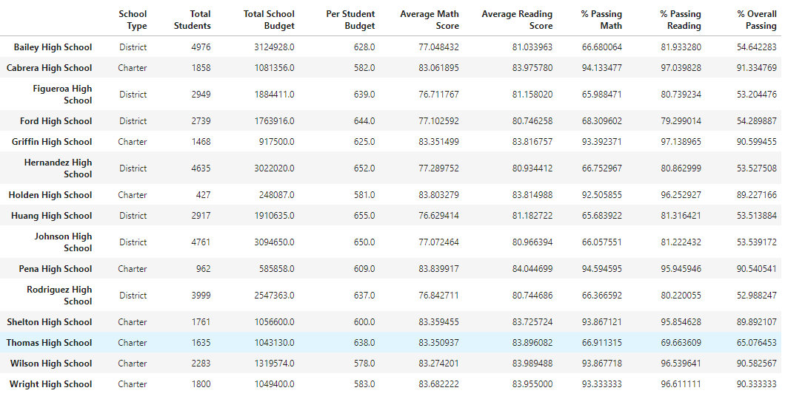
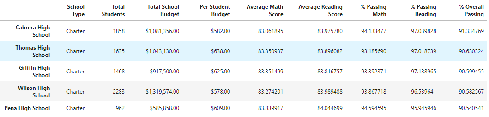
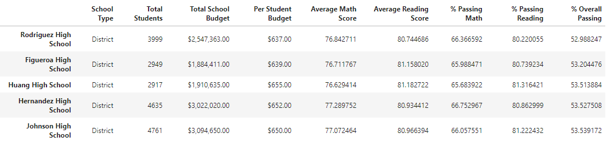
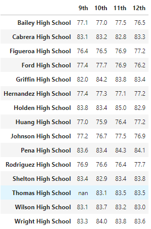
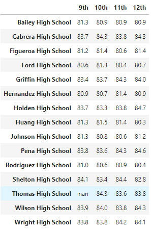

# School District Analysis

## Overview of School District Analysis

The purpose of this analysis is to find out if there's any correlation between the budget per student and the overall passing percentages across a pool of high schools.  Based on the analysis, it was discovered that 9th graders at Thomas High School had incorrect test scores, which led to the request for updated data analysis.  It was determined that the best decision was to update/replace specific 9th grade math and reading scores at Thomas High School, while keeping the integrity of all other data consistent.  Incorrect math and reading scores were replaced with the value "NaN", or "Not-a-number".  

## Results

- How is the district summary affected?
  - Compared against the original dataset and across all 15 schools, the average math score dropped 0.1%, the average reading score remained unchanged, the percentage passing math dropped 0.2%, the percentage passing reading dropped 0.3%, and the overall passing percent dropped 0.1%.

- How is the school summary affected?
  - For Thomas High School, the percentage passing math fell from 93.3% to 66.9%.  The percentage passing reading fell from 97.3% to 69.7%.  And for overall passing percentage, Thomas High School fell from 90.9% to 65.1%.

- How does replacing the ninth graders’ math and reading scores affect Thomas High School’s performance relative to the other schools?
  - Once the 9th grade scores were omitted and 10-12th grade scores were only included for Thomas High School, there wasn't any ranking change and the school still placed as #2 for overall passing percentage.  In total, their overall passing percentage only changed only minimally by <1%.  As such, the bottom 5 ranked schools had no impact from this change either since Thomas High School never fell in to that category.
    - Top 5 Ranked Schools
    
    - Bottom 5 Ranked Schools
    

- How does replacing the ninth-grade scores affect the following:
  - Math and reading scores by grade
    - For 9th Graders at Thomas High School, the score nows shows as NaN for both average math and reading scores by grade.  However average grades for grade levels 10-12 remained unchanged as there was no manipulated data in these groupings.
      
      
  - Scores by school spending
    - The $630-644 per student grouping saw the only change as this is where Thomas High School was grouped, however the change is small with each metric changing less than 0.1% in total.
  - Scores by school size
    - The scores for the Medium (1000-2000) size schools changed slightly, but by only <1% which seems pretty in-line with how other observed areas have been changing. Since Thomas High School has 1,635 students, they were included in this group and thus the only one to change.
  - Scores by school type
    - With Thomas High School being a charter school, that was the only bucket to change here, with no change occuring for district schools.  However, the change was again very minimal, with a decline of <0.1% for overall passing percentage.  Charter schools still heavily outperform district schools when looking at overall passing percentage alone.

## Summary
When looking at the total district, there was only a minor impact of updating 9th grade scores at Thomas High School, with total district overall passing percentage only declining by 0.1%.  When looking at schools ranked by highest overall passing percentage, Thomas High School did not change it's position and still came in at #2, however their school did decrease but by only less than 1%.  For school size breakdown, the only group that saw a change was for medium schools of 1000-2000 students as this is where Thomas High School was placed in, however the change was again very minor with a decrease of less than 0.1% for overall passing percentage.  Finally, when looking at schools by type, charter schools was the only group to change, but again was very minimal with a decline of less than 0.1% in total.  Overall, the change in 9th grade scores at Thomas High School had very minimal impact district-wide, and once 10th-12th graders were the only scores averaged out at Thomas High School, their school metrics saw very minor change as well. 
